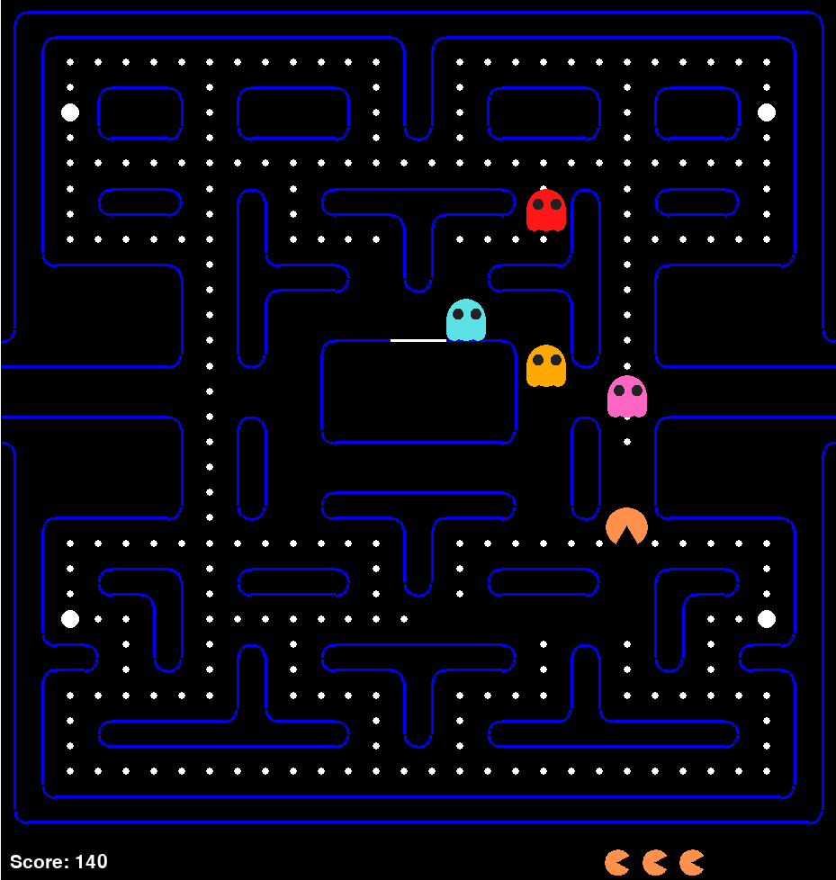

# Project Pacman

Задача игрока — управляя Пакманом, съесть все точки в лабиринте, избегая встречи с привидениями. В начале призраки находятся в недоступной Пакману прямоугольной комнате в середине уровня, из которой они со временем освобождаются. Если привидение дотронется до Пакмана, то его жизнь теряется, призраки и Пакман возвращаются на исходную позицию, но при этом прогресс собранных точек сохраняется. Если при столкновении с призраком у Пакмана не осталось дополнительных жизней, то игра заканчивается. По бокам лабиринта находятся два входа в один туннель, при вхождении в который Пакман и призраки выходят с другой стороны лабиринта.



## Установка:
```
git clone git@github.com:VasVol/project_pacman.git
cd project_pacman
git checkout dev
python3 -m venv venv
source venv/bin/activate
pip install -r requirements.txt
```
Необходимо проверить, что установлено всё из requirements.txt

## Запуск:
```
python3 main.py
```

## Исправление проблем:
Если возникает ошибка из-за звука mixer, выполнить эти две строчки:
```
sudo apt-get install libsdl1.2-dev libsdl-image1.2-dev libsdl-mixer1.2-dev libsdl-ttf2.0-dev
sudo sdl-config --cflags --libs
```
